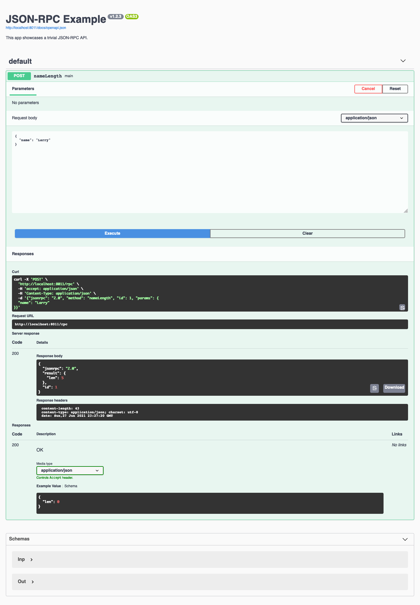

# jsonrpc

[](https://github.com/swaggest/jsonrpc/actions?query=branch%3Amaster+workflow%3Atest-unit)
[](https://codecov.io/gh/swaggest/jsonrpc)
[](https://pkg.go.dev/github.com/swaggest/jsonrpc)
[](https://wakatime.com/badge/github/swaggest/jsonrpc)


Self-documented [JSON-RPC](https://www.jsonrpc.org/) 2.0 server in Go.

## Example

```go
package main

import (
	"context"
	"log"
	"net/http"

	"github.com/go-chi/chi/v5"
	"github.com/swaggest/jsonrpc"
	"github.com/swaggest/swgui"
	"github.com/swaggest/swgui/v3cdn"
	"github.com/swaggest/usecase"
)

func main() {
	apiSchema := jsonrpc.OpenAPI{}
	apiSchema.Reflector().SpecEns().Info.Title = "JSON-RPC Example"
	apiSchema.Reflector().SpecEns().Info.Version = "v1.2.3"

	apiSchema.Reflector().SpecEns().Info.WithDescription("This app showcases a trivial JSON-RPC API.")

	h := &jsonrpc.Handler{}
	h.OpenAPI = &apiSchema
	h.Validator = &jsonrpc.JSONSchemaValidator{}
	h.SkipResultValidation = true

	type inp struct {
		Name string `json:"name"`
	}

	type out struct {
		Len int `json:"len"`
	}

	u := usecase.NewIOI(new(inp), new(out), func(ctx context.Context, input, output interface{}) error {
		output.(*out).Len = len(input.(*inp).Name)

		return nil
	})
	u.SetName("nameLength")

	h.Add(u)

	r := chi.NewRouter()

	r.Mount("/rpc", h)

	// Swagger UI endpoint at /docs.
	r.Method(http.MethodGet, "/docs/openapi.json", h.OpenAPI)

	r.Mount("/docs", v3cdn.NewHandlerWithConfig(swgui.Config{
		Title:       apiSchema.Reflector().Spec.Info.Title,
		SwaggerJSON: "/docs/openapi.json",
		BasePath:    "/docs",
		SettingsUI:  jsonrpc.SwguiSettings(nil, "/rpc"),
	}))

	// Start server.
	log.Println("http://localhost:8011/docs")

	if err := http.ListenAndServe(":8011", r); err != nil {
		log.Fatal(err)
	}
}
```


